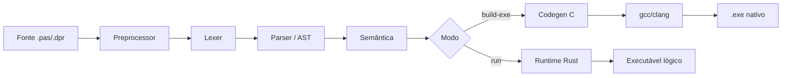

**Última consolidação:** 31/05/2026\
**Versão do binário:** `2.22.0` (`Cargo.toml`)\
**Fontes:** [Changelog](/essentials/changelog), [Sprints → Versões](/roadmap/sprints-overview), [Débito técnico](/technical-debt/backlog), [Review 360°](/roadmap/review-360)

<Note>
  O documento legado [Status v1.5](/history/improvements/status-v1-5) (17/10/2025) foi **substituído** por esta página. Use-o apenas como registro histórico de polimorfismo v1.5.
</Note>

## Resumo executivo

O CrabPascal é um compilador/interpreter Pascal escrito em Rust com:

- Pipeline **lexer → parser → AST → semântica → codegen → runtime**
- RTL em `rtl/` com shims `System.*` (SysUtils, Classes, Generics.Collections, IOUtils)
- Runtime heap para objetos Delphi, VMT, properties, generics parciais
- CLI multi-comando e extensão VS Code/Cursor
- Governança por **sprints** (1 sprint ≈ 1 release) desde maio/2026

## Entregas por onda (2026)

| Sprint | Versão | Foco principal |
| --- | --- | --- |
| 1 | v2.9.9 | Diagnósticos com spans reais |
| 2 | v2.10.0 | `System.*` / namespaces |
| 3 | v2.11.0 | Classes / Streams mínimo |
| 4 | v2.12.0 | Exceptions (`try/except/finally`) |
| 5 | v2.13.0 | Strings Delphi (`pascal_*`) |
| 6 | v2.14.0 | Properties OO |
| 7 | v2.15.0 | Generics.Collections \+ `var` |
| 8 | v2.16.0 | Unicode UTF-16 |
| 9 | v2.17.0 | Paridade run/build |
| 10 | v2.18.0 | Strings no codegen C |
| 11 | v2.19.0 | Parser hardening |
| 12 | v2.20.0 | Properties por método |
| 13 | v2.21.0 | Build honesto (exceptions) |
| 14 | v2.22.0 | IOUtils \+ units com ponto |
| 15 | v2.23.0 | Gate E2E Horse/CRUD (porta efêmera, HTTP real) |
| 16 | v2.24.0 | Rotas parametrizadas `:id`, 404, `Res.Send` |
| **17** | **v2.25.0** | **🔄 Em andamento:**`class var`, `System.JSON`, CRUD `ProdutoService` |
| 18–20 | v2.26.0 → v2.28.0 | JSON completo, paridade `build` Horse, IDE/marketplace |

**Contagem:** 16 sprints fechadas · 1 em andamento (S17) · 3 programadas (S18–S20).

Detalhes de cada release: pasta [Releases](/releases/release-v2-22-0).

## O que funciona hoje (alto nível)

### Linguagem e runtime

- Programas `.dpr` / units com `uses` recursivo
- Classes, herança, `inherited`, construtores/destrutores
- Properties (field e accessor por método em `run`)
- Generics: superfície `TList`/`TDictionary` \+ RTL Collections
- Exceptions tipadas em runtime; codegen C falha explicitamente (sem simulação silenciosa)
- Strings com conformidade UTF-16 crescente

### Ferramentas

- `check` com diagnósticos posicionados (base Sprint 1)
- `run` via `complete_runtime.rs`
- `build-exe` com toolchain C (paridade em evolução)
- Pré-processador com `{$IFDEF}`, includes, modo Delphi/FPC

### Ecossistema

- Exemplos Horse (`examples/`, `ping-pong`, `crud`)
- Extensão VS Code (marketplace); publicação Cursor/Open VSX adiada (CI)
- Testes Rust \+ fixtures \+ E2E HTTP (Sprint 16)

## Gaps conhecidos (prioridade)

Consulte o [backlog completo](/technical-debt/backlog). Destaques:

| Prioridade | Item | Área |
| --- | --- | --- |
| P0 | `class var`, `System.JSON`, E2E `ProdutoService` | Parser / RTL / Horse (**Sprint 17 — em andamento**) |
| P1 | `check` → Problems panel IDE | Extensão |
| P1 | CRUD E2E completo com `ProdutoService` | Horse \+ RTL |
| P2 | Publicação extensão alinhada ao binário | CI / Marketplace |
| P2 | Cobertura codegen C (properties, VMT parent) | Codegen |

## Marcos históricos (out/2025)

Antes dos sprints 2026, o projeto passou por marcos documentados em **Histórico e melhorias**:

- **v1.5** — polimorfismo e OOP completo
- **v2.0** — arquitetura compilador real (não interpretador puro)
- **v2.1–v2.8** — preprocessor, API Horse, extensão VS Code, “release final” out/2025

Esses relatórios permanecem valiosos como **linha do tempo de melhorias**, mas números de compatibilidade (% Delphi) neles estão **superseded** pelo changelog 2026.

## Pipeline técnico

Documentação detalhada: [Visão técnica](/architecture/technical/tecnico-detalhado) e [Arquitetura v2.0.1](/architecture/nova-arquitetura-v2-0-1).

## Leitura recomendada

1. [Changelog](/essentials/changelog) — fonte canônica de versões
2. [Roadmap sprints](/roadmap/sprints-overview) — plano e entregas
3. [Review 360°](/roadmap/review-360) — gaps Delphi end-to-end
4. [Débito técnico](/technical-debt/backlog) — próxima onda de trabalho