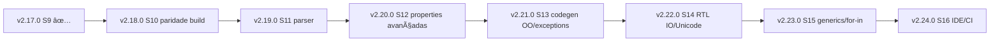

# Débito técnico — backlog para versões futuras

**Última atualização:** 2026-05-26 (pós **v2.19.0**)\
**Uso:** planejar sprints e releases. Auditoria detalhada: `docs/TECH_DEBT_AUDIT_POST_V2_16_0.md`.

---

## Fechado em v2.20.0 (Sprint 12)

| ID | O que foi feito |
| --- | --- |
| TD-PROPERTIES-001 | ✅ Properties com accessor por método em `run` |

---

## Fechado em v2.19.0 (Sprint 11)

| ID | O que foi feito |
| --- | --- |
| TD-PARSER-001 | ✅ `A,B: Integer` preserva múltiplos fields (record/class) |
| TD-PARSER-002 | ✅ `class(TBase, I1, I2)` popula `interfaces` no AST |
| TD-PARSER-004 | ✅ token `out` \+ parâmetros (tratado como `var`) |
| TD-PARSER-009 | ✅ fix: genéricos `<...>` não pulam mais o token `.` após `>` |

---

## Fechado em v2.18.0 (Sprint 10)

| ID | O que foi feito |
| --- | --- |
| TD-CODEGEN-006 | ✅ `Trim` parseado como função; `pascal_*`; `%s`/`%d` em `WriteLn`; decls C |
| TD-RUNTIME-001 (parcial) | ✅ build sem toolchain falha; gate nativo com skip sem gcc |
| TD-TEST-001 (parcial) | ✅ `run_build_parity` com gate `build_string_conformance_stdout_matches_run` |

---

## Fechado em v2.17.0 (Sprint 9)

| ID | O que foi feito |
| --- | --- |
| TD-SEMANTIC-001 | `Undefined variable` coerente em assignment |
| TD-RUNTIME-001 (parcial) | `build` sem toolchain não mascara sucesso via AST |
| TD-CODEGEN-006 (parcial) | builtins de string → `pascal_*` no C gerado |

---

## Plugins / Marketplaces (planejamento)

| ID | Prioridade | Descrição | Critério | Status |
| --- | --- | --- | --- | --- |
| TD-MARKETPLACE-001 | P1 | Publicar extensão VS Code (Marketplace) e Cursor (Open VSX) alinhada ao compilador | gate nativo passa em CI com gcc/clang \+ binário em `vscode-extension/bin/` | ⏸ Adiado (aguardando CI) |

---

## P0 — próxima onda (S12–S13)

| ID | Prioridade | Área | Descrição | Versão alvo |
| --- | --- | --- | --- | --- |
| TD-CODEGEN-001 | P0 | Codegen | Properties: getter/setter reais em C | v2.21.0 (S13) |
| TD-CODEGEN-002 | P0 | Codegen | Métodos: corpo real em C (não default) | v2.21.0 (S13) |
| TD-CODEGEN-003 | P0 | Codegen | `try`/`except`/`finally`/`raise` com semântica em C | v2.21.0 (S13) |
| TD-CODEGEN-005 | P0 | Codegen | VMT parent link efetivo | v2.21.0 (S13) |

---

## P1 — backlog (S14\+)

| ID | Prioridade | Área | Descrição | Versão alvo |
| --- | --- | --- | --- | --- |
| TD-RTL-IO-001 | P1 | RTL | `System.IOUtils`/`TEncoding`/`TFileStream` shims mínimos | v2.22.0 (S14) |
| TD-IDE-001 | P1 | IDE | `check` preencher Problems no VS Code/Cursor | v2.24.0 (S16) |
| TD-IDE-002 | P1 | IDE | Comando `build` da extensão usa `build-exe` | S10/S16 | Rafael |
| TD-RTL-IO-001 | P1 | RTL | Shims `System.IOUtils` / `TEncoding` / `TFileStream` mínimos | v2.22.0 S14 | Helena \+ Bruno |
| TD-UNICODE-001 | P1 | Unicode | `PChar`/buffer wide nativo; IO UTF-8↔UTF-16 explícito | S14/S8\+ | Helena |
| TD-PROPERTIES-001 | P1 | OO | Properties com accessor por método (read/write method) | v2.20.0 S12 | Helena \+ Lucas |

---

## P2 / P3 — backlog e DX

| ID | Prioridade | Descrição | Versão alvo |
| --- | --- | --- | --- |
| TD-TEST-004 | P3 | `tests/README.md` desatualizado (v2.8.0) | S16 |
| TD-DOCS-001 | P3 | Drift de versão em docs de QA | S16 |
| TD-PARSER-008 | P3 | Garantir zero `panic!` em paths de produção do parser | Contínuo |

---

## Mapa release → débitos (roadmap sugerido)

| Release | Sprint | Foco principal | IDs principais |
| --- | --- | --- | --- |
| **v2.17.0** | S9 | Baseline testes \+ paridade inicial | TD-SEMANTIC-001, TD-TEST-001†, TD-RUNTIME-001†, TD-CODEGEN-006†|
| **v2.18.0** | S10 | Paridade real run/build \+ strings C | TD-RUNTIME-001, TD-CODEGEN-006, TD-IDE-002 |
| **v2.19.0** | S11 | Parser Delphi surface | TD-PARSER-001, 002, 004, 007 |
| **v2.20.0** | S12 | Properties por método | TD-PROPERTIES-001, TD-CODEGEN-001†|
| **v2.21.0** | S13 | Codegen OO completo | TD-CODEGEN-001–003, 005 |
| **v2.22.0** | S14 | IO e encoding | TD-RTL-IO-001, TD-UNICODE-001 |
| **v2.23.0** | S15 | Generics / for..in | TD-CODEGEN-004 |
| **v2.24.0** | S16 | IDE Problems \+ CI estável | TD-IDE-001, TD-TEST-002 |

† parcialmente fechado em v2.17.0

---

## Critérios de aceite por tema (para programar versões)

### Paridade run/build (S10)

- Com `gcc`/`clang` no PATH: `crab-pascal build tests/fixtures/string_conformance.pas` compila, executa, stdout = `run`.
- Sem toolchain: `build` exit ≠ 0 e mensagem menciona compilador C / arquivo `.c` gerado.
- C gerado usa apenas `pascal_*` para builtins de string (incl. `Trim`).

### Codegen OO (S13)

- Fixture property `read F write F`: mesmo resultado em `run` e binário `build`.
- Fixture método com corpo: não retorna default silencioso.
- Fixture `try/except` \+ `raise`: comportamento equivalente ao runtime.

### Parser (S11)

- `check` verde em fixtures: `A,B: Integer`; `class(TBase, I1)`; `procedure P(out N: Integer)`.

### IDE (S16)

- Erro de `check` aparece em **Problems** com linha/coluna.
- Documentar diferença `build` vs `build-exe` na extensão.

---

## Gate de estabilidade E2E (Horse/CRUD)

**Definição:** só considerar “estável para marketplace” quando:

- **Horse API E2E**: servidor sobe, aceita request HTTP real, executa handler Pascal e responde `200` com payload esperado.
- **CRUD E2E (mínimo)**: servidor sobe e responde rota principal (`/produtos`) com JSON válido (e, no futuro, fluxo completo GET/POST/PUT/DELETE).
- **Robustez de porta**: porta ocupada não quebra execução (fallback para porta livre, ou `Listen(0)`).

**Status atual:** gate inicial implementado com `tests/horse_e2e.rs` e fixtures em `tests/fixtures/`.

---

## Como manter este documento

1. Ao fechar uma release: mover IDs para a seção **Fechado** com versão.
2. Ao abrir auditoria nova: copiar achados para tabela P0/P1 e atualizar CSV do board.
3. Não duplicar evidência de código aqui — apontar para `docs/audit/*.md` e linhas no repo.

**Próxima revisão sugerida:** após tag **v2.18.0** (Sprint 10).